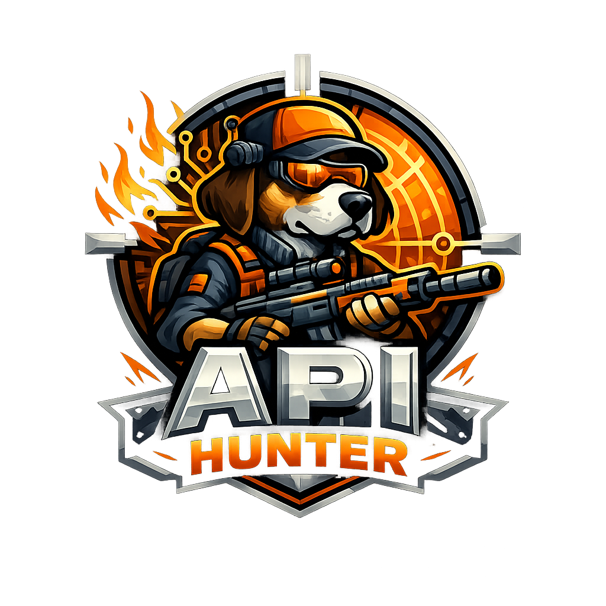

# 🎯 API Hunter

**API Hunter** is a modern, lightweight, and security-first API client designed for developers who need speed and flexibility without the bloat. Built with Next.js and powered by IndexedDB for local-only data persistence.



## ✨ Core Features

-   **🚀 Fast & Lightweight**: No heavy desktop shell; runs directly in your browser with high performance.
-   **📑 Multi-Tab Interface**: Work on multiple requests simultaneously with a familiar tabbed experience.
-   **🔐 Local-First Persistence**: Your data stays on your machine. We use **Dexie.js (IndexedDB)** for robust local storage.
-   **🌐 Environment Management**: Easily switch between Production, Staging, and Local environments with variable substitution.
-   **📜 Scripting & Testing**: Automate workflows with Pre-request and Post-response scripts (leveraging a secure sandbox).
-   **🛠️ Code Generation**: Instantly generate code snippets for cURL, JavaScript, Python, Go, and more.
-   **📤 cURL Import**: Standard cURL support to quickly import and test existing commands.
-   **🎭 Mock Server**: Simulate API responses with built-in mocking capabilities.

## 🛠️ Tech Stack

-   **Framework**: [Next.js](https://nextjs.org/) (App Router + Turbopack)
-   **State Management**: [Zustand](https://github.com/pmndrs/zustand)
-   **Persistence**: [Dexie.js](https://dexie.org/) (IndexedDB)
-   **Styling**: Tailwind CSS + Shadcn UI
-   **Icons**: Lucide React
-   **HTTP Client**: Axios

## 🚀 Getting Started

1.  **Clone & Install**:
    ```bash
    git clone https://github.com/your-username/api-hunter.git
    cd api-hunter
    npm install
    ```

2.  **Run Development Server**:
    ```bash
    npm run dev
    ```

3.  **Open in Browser**:
    Navigate to `http://localhost:3000`.

## 🛡️ Security

API Hunter is designed to be secure by default. Scripts are executed in a sandboxed environment to prevent access to sensitive browser globals. No data is sent to external servers except for the API requests you explicitly trigger.

---


